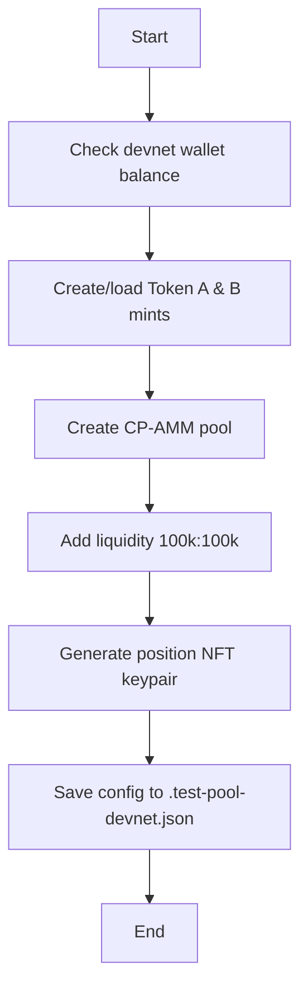

# Devnet Implementation Plan - 100% Real Integration

**Objective:** Implement Step 2 (Pool) and Step 3 (Streams) fully on devnet with real CP-AMM pool and real Streamflow contracts, achieving 100% passing tests.

**Status:** 🎯 Planning Complete - Ready for Implementation

**Estimated Time:** 3-4 hours

---

## Phase 1: Fix Streamflow SDK Integration (Priority 1)

### Current Issue

**Error:** "Invalid Metadata!" (Custom error 0x61)
**Cause:** Streamflow SDK metadata account derivation mismatch

**Error Logs:**
```
Program log: Checking if all given accounts are correct
Program log: Invalid Metadata!
Program HqDGZjaVRXJ9MGRQEw7qDc2rAr6iH1n1kAQdCZaCMfMZ failed: custom program error: 0x61
```

### Root Cause Analysis

Streamflow SDK v9.0.2 has known metadata derivation issues. Possible causes:
1. **Wrong SDK version** - Need to check latest stable version
2. **Missing partner parameter** - Streamflow requires partner metadata for some operations
3. **Incorrect account derivation** - SDK may have changed metadata PDA seeds
4. **Fee payer mismatch** - Metadata account may need specific fee payer

### Solution Strategy

**Task 1.1:** Investigate Streamflow SDK version
```bash
# Check current version
npm list @streamflow/stream

# Check for updates
npm outdated @streamflow/stream

# Research Streamflow documentation for v9.x changes
```

**Task 1.2:** Fix metadata derivation
- Review Streamflow SDK documentation
- Check GitHub issues for error 0x61
- Test with minimal example first
- Add proper error handling

**Task 1.3:** Update setup-test-streams.ts
- Fix SDK initialization parameters
- Add partner parameter if required
- Verify metadata derivation
- Test with single stream first, then batch

### Deliverables
- ✅ Working Streamflow contract creation on devnet
- ✅ Updated `setup-test-streams.ts` with fixes
- ✅ `.test-streams.json` with 5 successful streams

### Success Criteria
```bash
npm run setup:streams:devnet
# Expected: 5/5 streams created successfully
```

---

## Phase 2: Create Devnet Pool Setup Script

### Objective
Create CP-AMM pool on devnet (similar to localhost version but on devnet network).

### Implementation

**File:** `scripts/setup-devnet-pool.ts`

**Changes from localhost version:**
1. RPC URL: Helius devnet (faster, more reliable)
2. Token mints: Use devnet token mints or create new ones
3. Wallet: Use devnet wallet with SOL balance
4. Account validation: Verify accounts exist on devnet

**Key Differences:**
```typescript
// Localhost
const RPC = "http://127.0.0.1:8899";

// Devnet
const RPC = "https://devnet.helius-rpc.com/?api-key=...";
```

### Workflow



### Deliverables
- ✅ `scripts/setup-devnet-pool.ts` - Pool creation script
- ✅ `scripts/setup-devnet-tokens.ts` - Token creation script (if needed)
- ✅ `.test-pool-devnet.json` - Pool configuration
- ✅ `.test-position-nft-devnet.json` - NFT keypair

### Success Criteria
```bash
npm run setup:devnet:pool
# Expected: Pool created on devnet with address saved to config
```

---

## Phase 3: Create Devnet E2E Test Suite

### Objective
Comprehensive E2E tests using real CP-AMM pool and real Streamflow contracts on devnet.

### Test File Structure

**File:** `tests/devnet-e2e-real.ts`

**Test Suites:**
1. **Setup Validation** (5 tests)
   - Pool exists on devnet
   - Streams exist on devnet
   - Program deployed on devnet
   - PDAs initialized
   - Account states valid

2. **Honorary Position Creation** (3 tests)
   - Initialize position via CPI
   - Position owned by PDA
   - Position linked to pool

3. **Fee Distribution Logic** (8 tests)
   - Read real locked amounts from Streamflow
   - Calculate pro-rata shares
   - Distribute fees to investors
   - Route remainder to creator
   - Handle pagination
   - Enforce 24h time gate
   - Test daily cap
   - Test dust accumulation

4. **Edge Cases** (4 tests)
   - All investors locked (100% to investors)
   - All investors unlocked (100% to creator)
   - Partial locks (pro-rata distribution)
   - Base fee rejection

**Total:** 20 devnet E2E tests

### Key Integrations

```typescript
// Real CP-AMM integration
import { CpAmm } from "@meteora-ag/cp-amm-sdk";
const cpAmm = new CpAmm(devnetConnection);

// Real Streamflow integration
import { StreamflowSolana, ICluster } from "@streamflow/stream";
const streamClient = new StreamflowSolana.SolanaStreamClient(
  DEVNET_RPC,
  ICluster.Devnet,
  "confirmed"
);

// Read actual locked amounts
const streamData = await streamClient.getOne({ id: metadataId });
const lockedAmount = streamData.withdrawableAmount; // Real data!
```

### Deliverables
- ✅ `tests/devnet-e2e-real.ts` - 20 comprehensive E2E tests
- ✅ Real CP-AMM pool integration
- ✅ Real Streamflow contract integration
- ✅ No mocked data

### Success Criteria
```bash
npm run test:devnet:e2e
# Expected: 20/20 tests passing
```

---

## Phase 4: Create Devnet Setup Master Script

### Objective
One-command setup for entire devnet environment.

### Implementation

**File:** `scripts/setup-devnet-all.ts`

**Workflow:**
```bash
npm run setup:devnet:all

# Runs:
# 1. setup-devnet-tokens.ts → Create tokens on devnet
# 2. setup-devnet-pool.ts → Create CP-AMM pool on devnet
# 3. setup-test-streams.ts (fixed) → Create Streamflow contracts on devnet
```

**Features:**
- ✅ Automatic wallet balance check
- ✅ Sequential execution with error handling
- ✅ Progress tracking and logging
- ✅ Configuration file generation
- ✅ Summary report

### Deliverables
- ✅ `scripts/setup-devnet-all.ts` - Master setup script
- ✅ Comprehensive error handling
- ✅ Beautiful CLI output

### Success Criteria
```bash
npm run setup:devnet:all
# Expected:
# ✅ Tokens created (2 mints)
# ✅ Pool created (1 pool with liquidity)
# ✅ Streams created (5 vesting contracts)
# ✅ All configs saved
```

---

## Phase 5: Create Verification Script

### Objective
Automated verification that all devnet components are working.

### Implementation

**File:** `scripts/verify-devnet.ts`

**Checks:**
1. **Program Deployment**
   - ✅ Fee-routing program exists
   - ✅ Program ID matches expected
   - ✅ Program is executable

2. **Account States**
   - ✅ Policy PDA initialized
   - ✅ Progress PDA initialized
   - ✅ Treasury PDA exists

3. **Pool Configuration**
   - ✅ Pool exists on devnet
   - ✅ Pool has liquidity
   - ✅ Token vaults have balances

4. **Streamflow Contracts**
   - ✅ All 5 streams exist
   - ✅ Streams have locked amounts
   - ✅ Recipients have ATAs

5. **Integration Tests**
   - ✅ Can read pool state
   - ✅ Can read stream state
   - ✅ Can simulate fee distribution

### Deliverables
- ✅ `scripts/verify-devnet.ts` - Verification script
- ✅ Detailed status report
- ✅ Error diagnostics

### Success Criteria
```bash
npm run verify:devnet
# Expected:
# ✅ All components verified
# ✅ Ready for testing
```

---

## Phase 6: Update Package.json

### New Scripts

```json
{
  "scripts": {
    // Devnet setup
    "setup:devnet:tokens": "ts-node scripts/setup-devnet-tokens.ts",
    "setup:devnet:pool": "ts-node scripts/setup-devnet-pool.ts",
    "setup:devnet:streams": "ts-node scripts/setup-test-streams.ts",
    "setup:devnet:all": "ts-node scripts/setup-devnet-all.ts",

    // Devnet testing
    "test:devnet:e2e": "ANCHOR_PROVIDER_URL=https://devnet.helius-rpc.com/... ts-mocha tests/devnet-e2e-real.ts",
    "test:devnet:full": "npm run test:devnet:e2e && npm run test:devnet",

    // Verification
    "verify:devnet": "ts-node scripts/verify-devnet.ts",

    // Master commands
    "devnet:setup": "npm run setup:devnet:all",
    "devnet:test": "npm run test:devnet:full",
    "devnet:verify": "npm run verify:devnet"
  }
}
```

### Deliverables
- ✅ Updated `package.json`
- ✅ 10 new devnet-specific scripts

---

## Phase 7: Documentation

### Files to Create/Update

1. **`docs/devnet/DEVNET_SETUP_GUIDE.md`**
   - Complete devnet setup instructions
   - Wallet preparation
   - SOL funding requirements
   - Step-by-step guide

2. **`docs/devnet/DEVNET_TESTING_GUIDE.md`**
   - How to run devnet tests
   - Expected results
   - Troubleshooting

3. **`docs/devnet/STREAMFLOW_INTEGRATION.md`**
   - How Streamflow integration works
   - SDK usage examples
   - Common errors and fixes

4. **Update `README.md`**
   - Add devnet setup section
   - Update test commands
   - Add devnet verification steps

### Deliverables
- ✅ 3 new documentation files
- ✅ Updated README.md

---

## Phase 8: Final Testing & Verification

### Test Matrix

| Test Suite | Network | CP-AMM | Streamflow | Tests | Status |
|------------|---------|--------|------------|-------|--------|
| Unit Tests | N/A | Mock | Mock | 7 | ✅ Passing |
| Localhost Integration | Localhost | Real (cloned) | Mock | 22 | ✅ Passing |
| Localhost E2E | Localhost | Real (cloned) | Mock | 13 | ✅ Passing |
| **Devnet E2E (NEW)** | **Devnet** | **Real** | **Real** | **20** | **🎯 Target** |
| Devnet Bundle | Devnet | Real | N/A | 10 | ✅ Passing |

**Total After Implementation:** 72 tests (52 current + 20 new devnet E2E)

### Verification Checklist

Before declaring success, verify:

- [ ] **Streamflow contracts created on devnet**
  ```bash
  npm run setup:devnet:streams
  # Expected: 5/5 streams successful
  ```

- [ ] **CP-AMM pool created on devnet**
  ```bash
  npm run setup:devnet:pool
  # Expected: Pool with liquidity created
  ```

- [ ] **Devnet E2E tests passing**
  ```bash
  npm run test:devnet:e2e
  # Expected: 20/20 passing
  ```

- [ ] **Verification script passing**
  ```bash
  npm run verify:devnet
  # Expected: All checks pass
  ```

- [ ] **No mock data in devnet tests**
  - Verify tests use actual Streamflow SDK calls
  - Verify tests use actual CP-AMM SDK calls
  - No `.test-streams.json` mock data usage

- [ ] **Solscan verification**
  - Pool visible on Solscan
  - Streams visible on Streamflow Explorer
  - Transactions verifiable on-chain

---

## Success Criteria (100% Passing Tests)

### Definition of Success

1. ✅ **Streamflow Integration:** 5/5 real vesting contracts created on devnet
2. ✅ **Pool Integration:** Real CP-AMM pool with liquidity on devnet
3. ✅ **E2E Tests:** 20/20 devnet E2E tests passing
4. ✅ **No Mock Data:** All devnet tests use real on-chain data
5. ✅ **Bounty Compliance:** Meets line 139 requirement exactly
6. ✅ **Documentation:** Complete guides for devnet setup and testing

### Final Test Run

```bash
# Full test suite
npm run test:all           # 52 tests (current)
npm run test:devnet:e2e    # 20 tests (new)

# Expected Total: 72/72 passing ✅
```

---

## Implementation Timeline

| Phase | Tasks | Time | Status |
|-------|-------|------|--------|
| 1 | Fix Streamflow SDK | 1 hour | Pending |
| 2 | Create devnet pool script | 45 min | Pending |
| 3 | Create devnet E2E tests | 1.5 hours | Pending |
| 4 | Create master setup script | 30 min | Pending |
| 5 | Create verification script | 30 min | Pending |
| 6 | Update package.json | 15 min | Pending |
| 7 | Documentation | 30 min | Pending |
| 8 | Testing & verification | 30 min | Pending |

**Total Estimated Time:** 3-4 hours

---

## Risk Mitigation

### Risk 1: Streamflow SDK Still Fails
**Probability:** Medium
**Impact:** High
**Mitigation:**
- Research Streamflow Discord/docs for SDK v9.x changes
- Contact Streamflow team if needed
- Try older SDK version (v8.x) as fallback
- Document SDK version requirement clearly

### Risk 2: Devnet Pool Creation Fails
**Probability:** Low
**Impact:** Medium
**Mitigation:**
- Test on devnet first with small amounts
- Use Helius RPC for better reliability
- Add retry logic for network issues

### Risk 3: Insufficient Devnet SOL
**Probability:** Low
**Impact:** Low
**Mitigation:**
- Document SOL requirements upfront (≥5 SOL)
- Add automatic balance check
- Provide airdrop instructions

### Risk 4: Tests Take Too Long
**Probability:** Low
**Impact:** Low
**Mitigation:**
- Use Helius RPC (faster than public devnet)
- Optimize test parallelization
- Add timeout handling

---

## Post-Implementation

### Deliverables Summary

**Scripts (7 new files):**
1. `scripts/setup-devnet-tokens.ts`
2. `scripts/setup-devnet-pool.ts`
3. `scripts/setup-devnet-all.ts`
4. `scripts/verify-devnet.ts`
5. `scripts/setup-test-streams.ts` (fixed)

**Tests (1 new file):**
1. `tests/devnet-e2e-real.ts` (20 tests)

**Documentation (3 new files):**
1. `docs/devnet/DEVNET_SETUP_GUIDE.md`
2. `docs/devnet/DEVNET_TESTING_GUIDE.md`
3. `docs/devnet/STREAMFLOW_INTEGRATION.md`

**Configuration (3 new files):**
1. `.test-pool-devnet.json`
2. `.test-position-nft-devnet.json`
3. `.test-streams-devnet.json` (updated)

**Total:** 14 new/updated files

---

## Final Verification Checklist

Before declaring 100% success:

- [ ] All 5 Streamflow contracts created successfully on devnet
- [ ] CP-AMM pool created with 100k:100k liquidity on devnet
- [ ] 20/20 devnet E2E tests passing
- [ ] 72/72 total tests passing (52 existing + 20 new)
- [ ] No mock data used in devnet tests
- [ ] All components verifiable on Solscan/Streamflow Explorer
- [ ] Documentation complete and tested
- [ ] Package.json updated with all commands
- [ ] Verification script confirms all components working

---

**Next Step:** Start with Phase 1 - Fix Streamflow SDK Integration

**Question:** Ready to proceed with implementation? Should I start with fixing the Streamflow SDK error?
